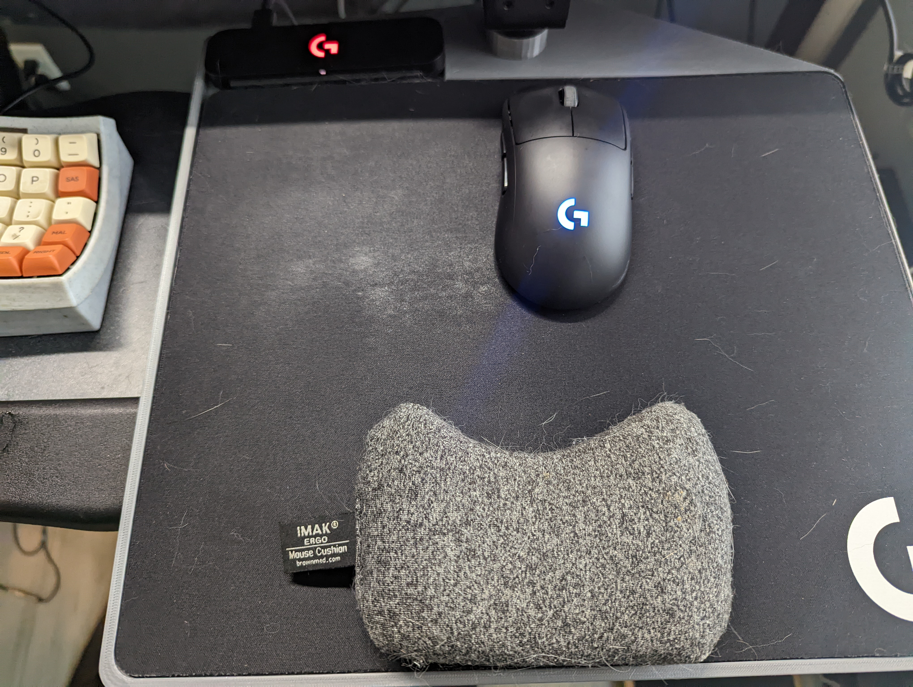

# Powerplatform

Parametric holder for [Logitech Powerplay](https://www.logitechg.com/en-us/products/gaming-mouse-pads/powerplay-wireless-charging.943-000109.html) designed to be mounted to a desk.

Default settings targeting [VIVO Desk Clamp](https://smile.amazon.com/gp/product/B07NLLZS8X/)


## Building

Generating a printable file is currently a multi-step, multi-program process.

### Generate scad files

With [leiningen](https://leiningen.org/) installed run the following from project root:

```shell
lein build
```

Or if you'd like to re-build the scad files as you update the parameters run:

```shell
lein auto build
```

After the scad files are built, there will be debug output in the terminal for the scad produced, this can be disabled by changing the `:debug` kwarg in `src/powerplatform/core.clj`.

### Exporting scad to an STL

Once you have generated the scad file simply open it inside [OpenSCAD](https://openscad.org/), render(F6) ensuring it looks correct, and export to STL(F7).

### Printing

Once you have the STL open it in your preferred slicer, I use Prusa Slicer, slice and print away. Depending on the precision of your printer you may need to sand the inside edges for the Powerplay to fit.

## Finished product


